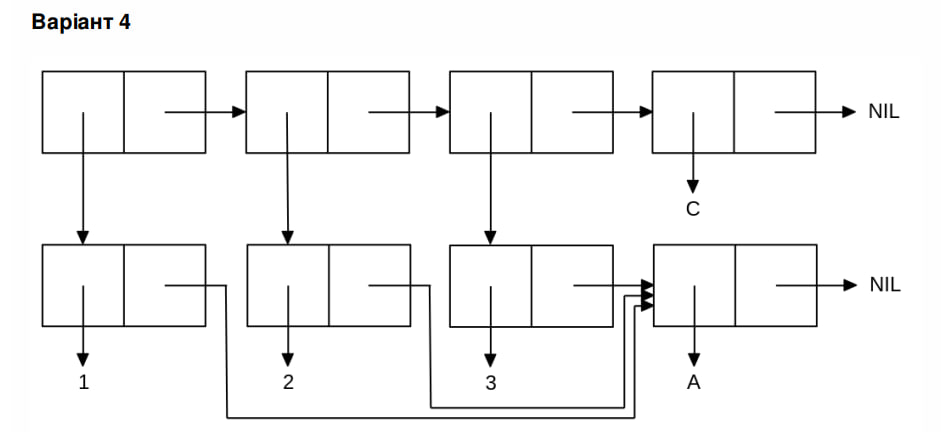

<p align="center"><b>МОНУ НТУУ КПІ ім. Ігоря Сікорського ФПМ СПіСКС</b></p>
<p align="center">
<b>Звіт з лабораторної роботи 1</b><br/>
"Обробка списків з використанням базових функцій"<br/>
дисципліни "Вступ до функціонального програмування"
</p>
<p align="right"><strong>Студент:</strong> Ольховський Максим Олександрович </p>
<p align="right"><strong>Група:</strong> КВ-13</p>
<p align="center"> 2024</p>

## Загальне завдання
1. Створіть список з п'яти елементів, використовуючи функції LIST і CONS . Форма
створення списку має бути одна — використання SET чи SETQ (або інших
допоміжних форм) для збереження проміжних значень не допускається. Загальна
кількість елементів (включно з підсписками та їх елементами) не має перевищувати
10-12 шт. (дуже великий список робити не потрібно). Збережіть створений список у
якусь змінну з SET або SETQ . Список має містити (напряму або у підсписках):
хоча б один символ
хоча б одне число
хоча б один не пустий підсписок
хоча б один пустий підсписок
2. Отримайте голову списку.
3. Отримайте хвіст списку.
4. Отримайте третій елемент списку.
5. Отримайте останній елемент списку.
6. Використайте предикати ATOM та LISTP на різних елементах списку (по 2-3
приклади для кожної функції).
7. Використайте на елементах списку 2-3 інших предикати з розглянутих у розділі 4
навчального посібника.
8. Об'єднайте створений список з одним із його непустих підсписків. Для цього
використайте функцію APPEND .

```lisp
(setq personal-list          ; task 1
(list
'laboratorna            ; at least one symbol 
28                 ; at least one number
(list 'number 2 8) ; at least one non-empty sublist        
'()                ; at least one empty sublist
(cons 'f 'g)))     ; another sublist


CL-USER> (car personal-list) ; task 2
LABORATORNA

CL-USER> (cdr personal-list) ; task 3
(28 (NUMBER 2 8) NIL (F . G))

CL-USER> (nth 2 personal-list) ; task 4
(NUMBER 2 8)

CL-USER> (last personal-list) ; task 5
((F . G))

CL-USER> (atom (first personal-list)) ; task 6
T
CL-USER> (atom (second personal-list))
T
CL-USER> (atom (last personal-list))
NIL
CL-USER> (listp (first personal-list))
NIL
CL-USER> (listp (third personal-list))
T
CL-USER> (listp (last personal-list))
T
CL-USER> (equalp (first personal-list) (last personal-list)) ; task 7
NIL
CL-USER> (numberp (first personal-list))
NIL
CL-USER> (numberp (second personal-list))
T
CL-USER> (append personal-list (second personal-list)) ; task 8
(LABORATORNA 28 (NUMBER 2 8) NIL (F . G) . 28)
```

## Варіант 12(4)
<p align="center">

</p>

## Завдання за варіантом
Створіть список, що відповідає структурі списку, наведеній на рисунку (за варіантом).
Для цього допускається використання не більше двох форм. Номер варіанту
обирається як номер у списку групи, який надсилає викладач на початку семестру (на
випадок, якщо протягом семестру стануться зміни в складі групи), за модулем 8: 1 -> 1, 2 -> 2, ..., 9 -> 1, 10 -> 2, ...

```lisp
(let ((var '(A)))  
  (list (cons 1 var)
         (cons 2 var)
         (cons 3 var)
         'C))

((1 A) (2 A) (3 A) C)
```
